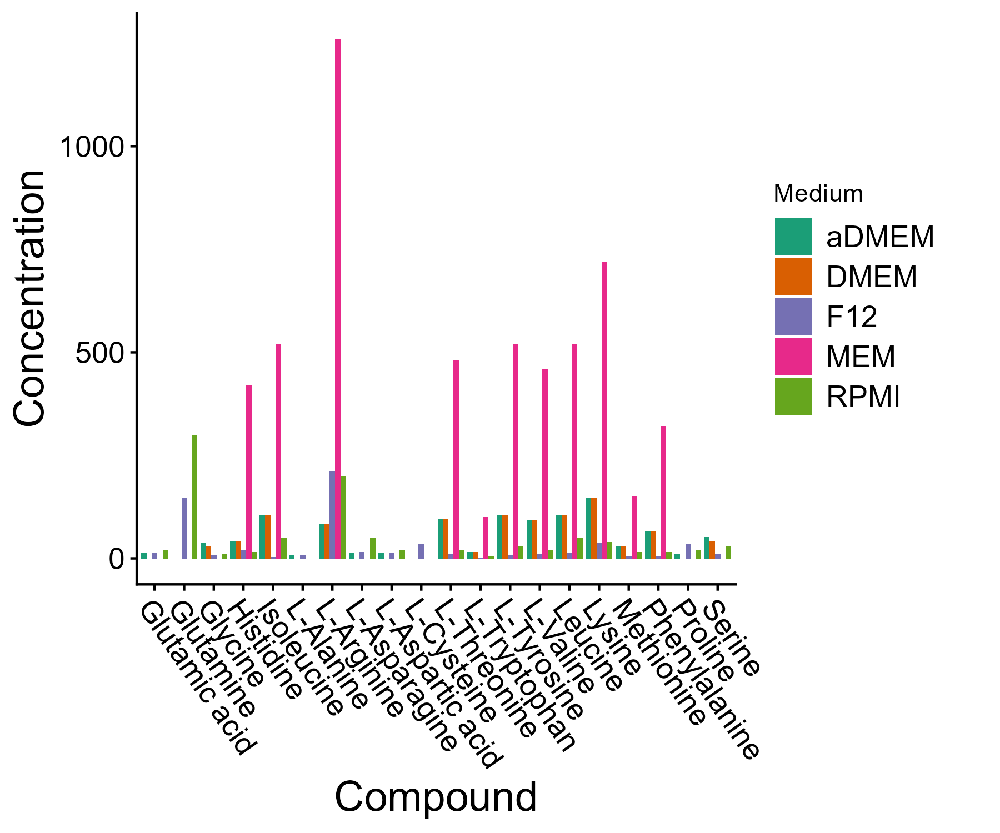
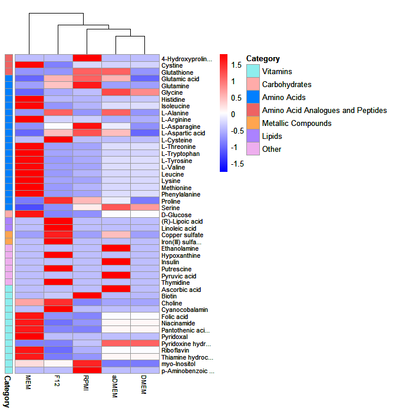

# met4media

`met4media` is an easy-to-use R package that enables users to compare the metabolite profiles of novel cell culture media with those of user specified media and/or a database of publicly available commercial cell culture media. The package is primarily designed to support media development using complex substrates, such as plant-based hydrolysates. 

The package provides functionality for metabolite standardization, categorization, comparison, and visualization. It standardizes metabolite names across datasets to account for differences in naming conventions. Metabolites can also be categorized into classes such as amino acids and vitamins, facilitating comparison of media composition. Finally, the package enables visualization of metabolite composition using bar plots and heatmaps.

# Installation

Installation in R can be performed directly from github using the `devtools` package:

```R
library(devtools)
install_github('Kathy-Isaac/met4media')
```

# Table of contents

1. [Standardization](#standardization)
2. [Categorization](#categorization)
3. [Comparison](#load-comparison-datasets)
4. [Visualization](#visualization)
   1. [Bar plot](#bar-plot)
   2. [Heatmap](#heatmap)
5. [Acknowledgements](#acknowledgements)
   1. [Metabonanalyst](#metaboanalyst)
   2. [HMDB](#hmdb)

# Standardization
The 'standardize' function standardizes metabolite names across datasets to account for differences in naming conventions. Its input argument is a dataframe with a 'Name' column containing metabolite names to be standardized. It outputs a dataframe with columns containing the standardized name, Human Metabolome Database (HMDB) ID and KEGG ID. The function is a wrapper that uses MetaboAnalyst API.

```R
# Basic example

example <-  data.frame(
  Name = c("Glucose", "Tyrosine", "Valine"),
  Concentration = c(4500, 3000, 2000)
)

df <- standardize(example)
```

**Table 1. Example input to standardize function.**

| Name | Concentration | 
|---|---:|
| Glucose | 4500 |
| Tyrosine | 3000 |
| Valine | 2000 |

**Table 2. Example output from standardize function.**

| Name | Concentration | Compound | KEGG | HMDB |
|---|---:|---:|---:|---:|
| Glucose | 4500 | D-Glucose | C00031 | HMDB0000122 |
| Tyrosine | 3000 | L-Tyrosine | C00082 | HMDB0000158 |
| Valine | 2000 | L-Valine | C00183 | HMDB0000883 |

# Categorization

The 'categorize' function matches the HMDB ID of a metabolite to its HMDB class, HMDB sub-class and a manually curated category. The input is a dataframe with a 'HMDB' column containing HMDB IDs. It is recommended that the dataframe is first standardized using the `standardize` function to generate HMDB ids for each metabolite.

```R
# Basic example

example <-  data.frame(
  Name = c("Glucose", "Tyrosine", "Valine"),
  Concentration = c(4500, 3000, 2000)
)

df <- standardize(example)
df <- categorize(df)
```

**Table 2. Example output from categorize function.**

| Name | Concentration | Compound | KEGG | HMDB | Class | SubClass | Category |
|---|---:|---:|---:|---:|---:|---:|---:|
| Glucose | 4500 | D-Glucose | C00031 | HMDB0000122 | Organooxygen compounds | Carbohydrates and carbohydrate conjugates | Carbohydrates |
| Tyrosine | 3000 | L-Tyrosine | C00082 | HMDB0000158 | Carboxylic acids and derivatives | Amino acids, peptides, and analogues | Amino Acids |
| Valine | 2000 | L-Valine | C00183 | HMDB0000883 | Carboxylic acids and derivatives | Amino acids, peptides, and analogues | Amino Acids |

# Load Comparison Datasets

The 'load_comparison' function loads media composition of fully and/or partially defined commercial media and outputs it either as a dataframe or appended to the user supplied sample dataframe for comparison. It takes three optional arguments. The first 'df' contains the sample metabolite composition to append the commercial media composition to for comparison. The second 'medium' is a vector containing the names of the commercoal media to load. The complete media list includes DMEM, aDMEM, DMEM.F12, aDMEM.F12, F12, F10, MEM, IMDM, RPMI, aRPMI, McCoy5A, NBM, StemPro, mTeSR, E6, E8, ECGM, EpiLife, N2B27, StemSpan, UC, PluriSTEM. The third argument 'defined' if set to TRUE only outputs fully defined commercial media. 

```R
# Example to load all commercial media available
commercial <- load_comparison(defined = FALSE)

# Example to load all defined commercial media available
commercial <- load_comparison()

# Example to load selected commercial media
commercial <- load_comparison(medium = c("aDMEM", "DMEM", "F12"))

# Example to append selected commercial media to user supplied data for comparison
example <-  data.frame(
  Name = c("Glucose", "Tyrosine", "Valine"),
  Concentration = c(4500, 3000, 2000)
)
df <- standardize(example)
df <- categorize(df)
df <- load_commercial(df = df,  medium = c("aDMEM", "DMEM", "F12"))
```

# Visualization

Multiple different media can be compared visually using the two functions described below.

## Bar Plot

The 'plot_barplot' function generates a barplot using the ggplot2 package. At minimum, it takes as input a dataframe containing metabolomics/composition data of different cell culture media. The default settings plot 'Compound' on the X-axis, 'Concentration' on the Y-axis and 'Medium' as the fill variable. The 'category' argument allows for filtering to specific categories such as amino acids. Other arguments alter the visual appearance of the plot. 

```R
# Basic example with commercial media
commercial <- load_comparison(medium = c("aDMEM", "DMEM", "F12", "RPMI", "MEM"))
plot_barplot(commercial, category = "Amino Acids")
```


**Figure 1. Example bar plot.**

## Heatmap
The 'plot_heatmap' function generates a heatmap using the pheatmap package. At minimum, it takes as input a dataframe containing metabolomics/composition data of different cell culture media. The 'category' argument allows for filtering to specific categories such as amino acids. Other arguments alter the visual appearance of the plot. 

```R
# Basic example with commercial media
commercial <- load_comparison(medium = c("aDMEM", "DMEM", "F12", "RPMI", "MEM"))
plot_heatmap(commercial)
```


**Figure 1. Example heatmap.**

# Acknowledgements

## MetaboAnalyst

Compound name mapping in met4media is performed using the MetaboAnalyst API. The API is used to map metabolite names to standardized identifiers, including HMDB and KEGG identifiers.

MetaboAnalyst is an open-source platform for metabolomics data analysis. This package uses the MetaboAnalyst API for non-commercial scientific and educational purposes and does not redistribute the MetaboAnalyst software or database.

Please cite MetaboAnalyst when using this resource:
Pang, Z., Lu, Y., Zhou, G., Hui, F., Xu, L., Viau, C., Spigelman, A., MacDonald, P., Wishart, D., Li, S., and Xia, J. (2024) MetaboAnalyst 6.0: towards a unified platform for metabolomics data processing, analysis and interpretation Nucleic Acids Research (doi: 10.1093/nar/gkae253)
Pang, Z., Xu, L., Viau, C., Lu, Y., Salavati, R., Basu, N., and Xia, J. (2024) MetaboAnalystR 4.0: a unified LC-MS workflow for global metabolomics Nature Communications (doi: 10.1038/s41467-024-48009-6)

Please see the [MetaboAnalyst website](https://www.metaboanalyst.ca/MetaboAnalyst/home.xhtml) for current information regarding the software, API, and applicable terms of use.

## HMDB

Metabolite classification information (`HMDB`, `Class`, and `SubClass`) is derived from HMDB. The `Category` field is a higher-level categorization developed for `met4media` based on HMDB classification information.

HMDB is licensed under the Creative Commons Attribution-NonCommercial 4.0 International license (CC BY-NC 4.0). This package uses the HMDB-derived information for non-commercial scientific and educational purposes.

Please cite HMDB when using this resource:
Wishart DS, Tzur D, Knox C, et al., HMDB: the Human Metabolome Database. Nucleic Acids Res. 2007 Jan;35(Database issue):D521-6. 17202168 
Wishart DS, Knox C, Guo AC, et al., HMDB: a knowledgebase for the human metabolome. Nucleic Acids Res. 2009 37(Database issue):D603-610. 18953024 
Wishart DS, Jewison T, Guo AC, Wilson M, Knox C, et al., HMDB 3.0 — The Human Metabolome Database in 2013. Nucleic Acids Res. 2013. Jan 1;41(D1):D801-7. 23161693 
Wishart DS, Feunang YD, Marcu A, Guo AC, Liang K, et al., HMDB 4.0 — The Human Metabolome Database for 2018. Nucleic Acids Res. 2018. Jan 4;46(D1):D608-17. 29140435 
Wishart DS, Guo AC, Oler E, et al., HMDB 5.0: the Human Metabolome Database for 2022. Nucleic Acids Res. 2022. Jan 7;50(D1):D622–31. 34986597 

Please see the [HMDB website](https://hmdb.ca/) and its licensing information for the current terms.
